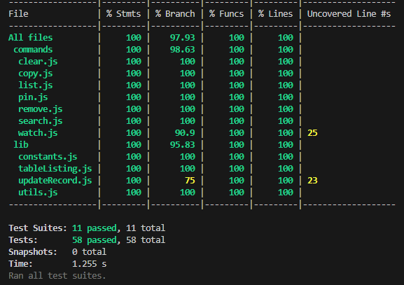

# ClipVault

A powerful and flexible clipboard manager for the terminal, built with Node.js.
Easily store, search, pin, remove, and interact with clipboard history — all from your command line.

### ⚡ Features

- 📥 Automatically watch and save clipboard contents
- 🔍 Multiple query search
- 📌 Pin and unpin entries
- 🧹 Clear old or unwanted clipboard entries
- 🧾 Easily copy previous entries back to clipboard
- 💾 Persistent history saved locally in JSON format

<br>

### 📦 Installation

```
git clone https://github.com/ricardoliveira5ro/ClipVault.git
cd clipvault
npm install
```

Globally CLI usage

```
npm link
```

<br>

### 🚀 Usage

##### 🟢 Start Watching Clipboard

```bash
clipvault watch
```
Continuously monitors clipboard changes and saves them

##### 📄 List All Entries

```bash
clipvault list
```

##### 🔍 Search Clipboard History

```bash
clipvault search --query "password"
clipvault search --date "2025-07-01"
clipvault search --pinned
clipvault search --min-size 10 --max-size 1000
```

##### 📌 Pin/Unpin an Entry

```bash
clipvault pin <id>
clipvault unpin <id>
```

##### ❌ Remove an Entry

```bash
clipvault remove <id>
clipvault remove <id> --force  # Remove pinned
```

##### 🧹 Clear Entries

```bash
clipvault clear
clipvault clear --days 7  # Clears entries older than 7 days
clipvault clear --days 7 --force
```

##### 📋 Copy an Entry

```bash
clipvault copy <id>
```
Copies the clipboard entry with given ID back into the system clipboard.

<br>

### 👨🏼‍💻 Developer Guide

🧪 Running Tests
```
npm run test
```
Mocks are created using `jest.unstable_mockModule` for ESM compatibility

✅ Coverage
```
npm run coverage
```
Current code coverage: 97.93%



<br>

### 📁 File Structure

```python
├── 📂 bin/
│   ├── 📄 index.js/        # CLI entry point
├── 📂 commands/            # CLI commands
├── 📂 lib/                 # Shared utility modules
├── 📂 __tests__/           # Unit tests
├── 📄 jest.config.cjs
├── 📄 package.json
└── 📄 README.md
```
